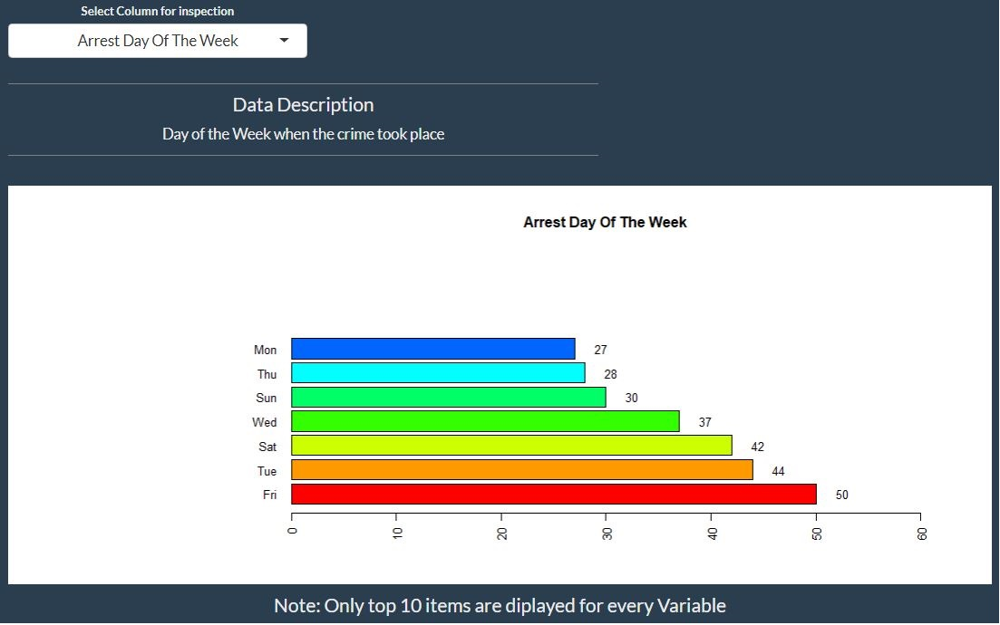

```{r setup, include=FALSE}
knitr::opts_chunk$set(echo = TRUE)
```

## Sammamish, Washington, USA

Sammamish is a city in King County, Washington, United States. 
The population is estimated 65,733 in 2018. Located on a plateau, the city is bordered by Lake Sammamish to the west and the Snoqualmie Valley to the east.

The city is relatively peaceful and safe to live in.

```{r, out.width='70%', fig.align='center', fig.cap='Arrests made by Investigating Agency'}

```


This analysis is carried out for more of as Educational / Entertainment purposes. It is however based on the real data

## Data set consists of 258 observation and 32 Variables

```{r}
  load("crimeSummary.RData")
  dim(getArrestData)
```

## Crime Analysis

We have used bar plots to see how the crime happens in Sammamish

### How to read the Bar plot
* Categorical variable.
* Data are displayed as a series of vertical (or horizontal) bars whose heights indicate the number (count) or proportion (percentage) of values in each category.
* Look at the Visual representation of a table. and check

  - How do the heights of the bars compare? 
  - Which is the largest?
  - Which is the Smallest?

```{r, out.width='70%', fig.align='center', fig.cap='Arrests made by Investigating Agency'}

```

As can be seen that out of the two, the **Sammamish Police Department** was the busiest in making the arrests. 

#### Further look into the data how the Crime is distributed by the day of the week
It is obvious from the bar plot (ref figure #2) of crime frequency categorized by day of the week that **Monday** is the safest day


```{r, out.width='70%', fig.align='center', fig.cap='Arrests plotted against Day of the week'}

```


#### Crime as it looks on Monthly basis

**April** is the month with the lowest crime rate.

```{r, out.width='70%', fig.align='center', fig.cap='Arrests made on Months Basis'}

```


#### Time of the Day Crime Distribution

**Early Morning** is the time when we have least crime rate. May be the persons prone to get involved in crime don’t like to wake up early 


```{r, out.width='70%', fig.align='center', fig.cap='Arrests Vs Time of the Day'}

```


```{r echo=TRUE}
# cc <- case_when(
#   Time > 0 & Time < 4 ~ "Early Morning",
#   Time >= 4  & Time < 10 ~ "Morning",
#   Time >= 10  & Time < 15 ~ "Noon",
#   Time >= 15  & Time < 19 ~ "Evening",
#   Time >= 19  & Time < 24|bb == 0 ~ "Night"
# )
```

As per the formula early morning is the time between midnight and 4am


## Final Conclusion

### Early Morning (Midnight to 4am) on Monday in the month of April is the safest time in the city. i.e. **27th April 2020**

Enjoy

Well that was before **Covid19** virus ... Now there is no time that is safe to venture out. 


# Stay Inside and Stay safe